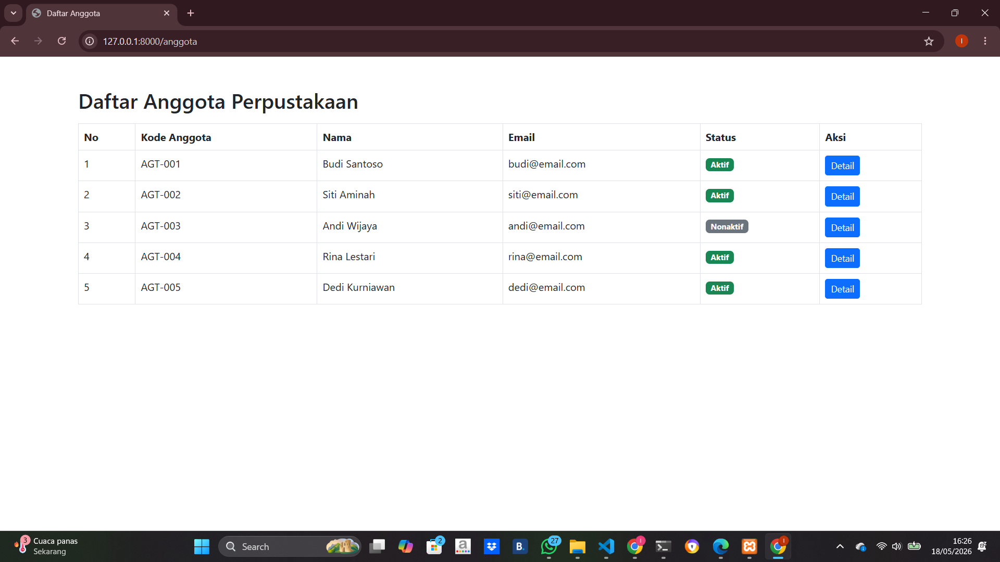
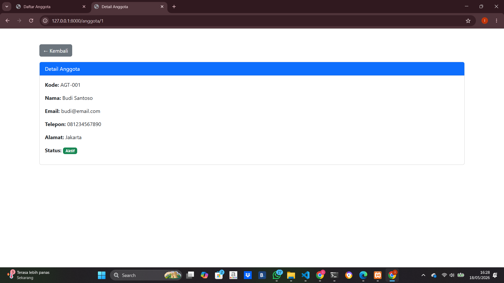
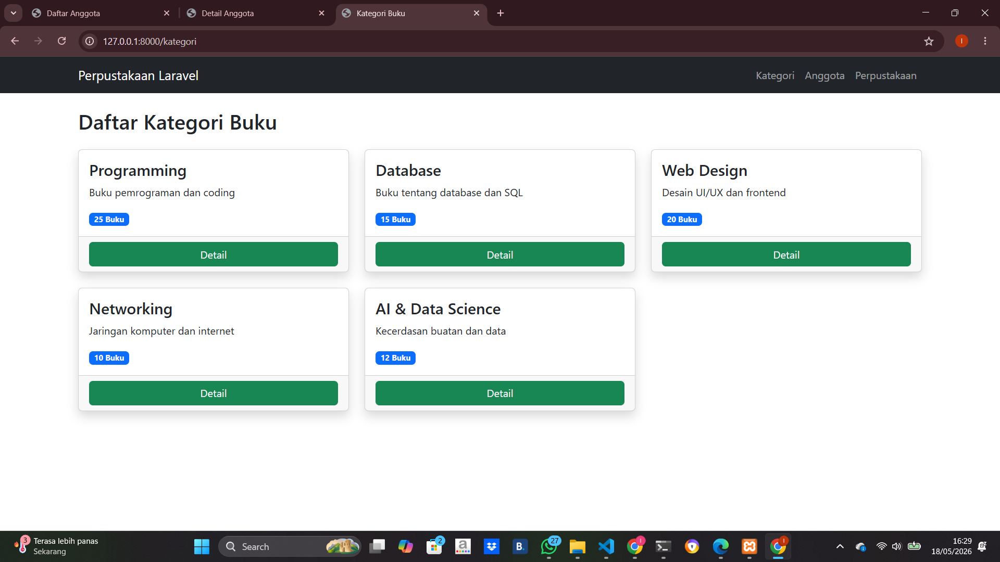
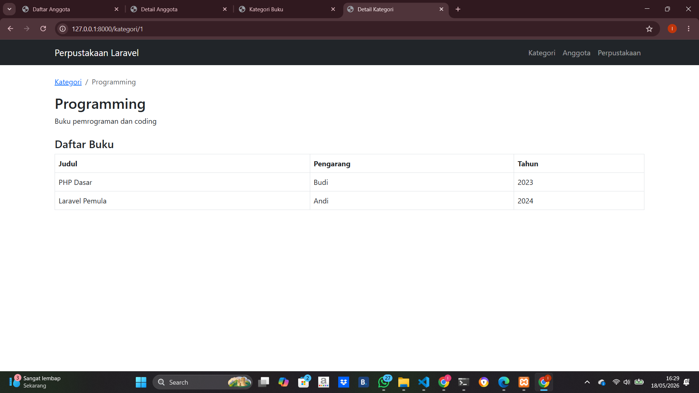
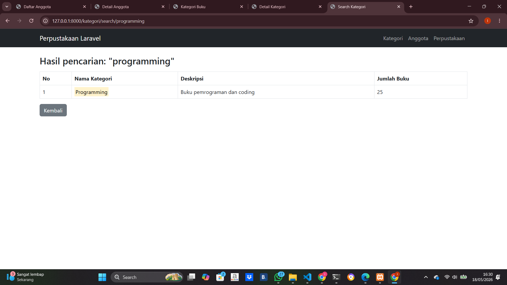

# Tugas Pertemuan 9 - Pemrograman Web 2

Nama : Indri Oktavia Ramadani
NIM : 60324078
Matkul : Pemweb II (B)

## Deskripsi
Project ini dibuat untuk memenuhi tugas Pertemuan 9 mata kuliah Pemrograman Web 2. Aplikasi menggunakan framework Laravel dengan konsep MVC (Model View Controller). 

Pada project ini terdapat fitur:
- Routing Laravel
- Controller
- View Blade
- Menampilkan data anggota perpustakaan
- Menampilkan kategori buku
- Detail kategori
- Pencarian kategori buku
- Tampilan menggunakan Bootstrap 5

Project dibuat sebagai latihan dasar pengembangan aplikasi web menggunakan Laravel.

## Fitur
### Tugas 1
- Routing anggota
- View daftar anggota
- Detail anggota
- Bootstrap 5

### Tugas 2
- KategoriController
- Daftar kategori
- Detail kategori
- Search kategori
- MVC Laravel

## Route yang Digunakan

### Anggota
- /anggota
- /anggota/1

### Kategori
- /kategori
- /kategori/1
- /kategori/search/programming

## Teknologi
- Laravel 12
- PHP 8
- Bootstrap 5

## Screenshot

### Daftar Anggota

### Detail Anggota

### Daftar Kategori

### Detail Kategori

### Search Kategori
